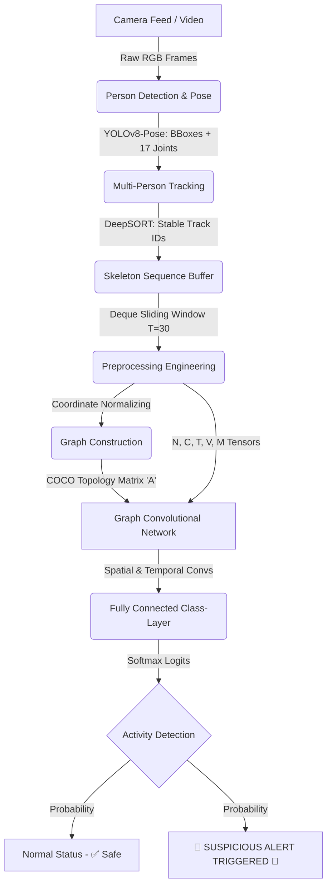

# 🚨 Suspicious Activity Detection using GCN & Computer Vision

## 🚧 Project Status & Roadmap (WIP)

**⚠️ NOTE: THIS PROJECT IS ACTIVELY A WORK IN PROGRESS.**

The architectural scaffolding and computer vision pipelines are fully implemented, but the AI's "brain" requires training before it can accurately classify activities.

### ✅ What is Completed:
- [x] **Pose Extraction (`yolov8`):** Fully functional person detection and 17-point skeletal mapping.
- [x] **Multi-Person Tracking (`DeepSORT`):** Fully functional persistent ID assignment across frames.
- [x] **Data Engineering (`SkeletonBuffer`):** Dynamically chunks live camera data into stable temporal sliding windows (T=30 tensors).
- [x] **Graph Topology (`graph_construction.py`):** Center-roots coordinate spaces and constructs the physical adjacency matrix.
- [x] **GCN Architecture (`gcn_model.py`):** The ST-GCN forward-pass neural network layout is error-free and locked in.
- [x] **Inference Scaffold (`inference.py`):** End-to-end framework capturing video, processing pose, and passing data to the model.

### ⏳ What is Left to Do (Next Steps):
- [ ] **Dataset Acquisition:** Sourcing a labeled dataset of normal vs. suspicious actions (e.g., UCF-Crime, NTU-RGB+D, or custom collected).
- [ ] **Training Loop Generation (`train.py`):** Building the PyTorch backpropagation script to compute loss and train the model weights.
- [ ] **Model Optimization:** Actually training the architecture to achieve high validation accuracy.
- [ ] **Final Deployment:** Saving the trained state dictionary (`.pth`) and loading it into `inference.py` to enable live, intelligent detection.

This project implements a state-of-the-art Computer Vision architecture designed to detect **suspicious activities** (such as violence, theft, or unusual rapid motion) directly from live camera feeds or recorded videos. It systematically discards environmental visual noise and exclusively parses isolated human anatomical motion using a sophisticated Graph Convolutional Network (GCN).

## 🧩 Architectural Flowchart



---

## ⚙️ Core Pipeline Breakdown (The Blueprint)

### Steps 1 & 2: `Spatial Parsing`
By leveraging Ultralytics' `YOLOv8-Pose` native inference, the system captures localized human bounding boxes concurrently alongside all `(x, y)` coordinate limits forming the 17 critical COCO skeletal physical joints. This abstracts the data from arbitrary visual pixels securely into raw human geometric formats.

### Step 3: `Multi-Person ID Tracking`
Couples the geometric raw poses directly into a `DeepSORT` appearance tracker via an active Intersect-over-Union (IoU) spatial matching map. Even if a physical frame drops rapidly, or a subject physically overlaps with another, the system assigns a strict continuous `Track_ID` classification logic.

### Step 4: `Neural Skeleton Buffering` 
GCN models inherently require time-windows mathematically to understand sequential mechanics. The `SkeletonBuffer` actively utilizes dynamic double-ended queues to efficiently slide a sequence-length memory window for *each independent* Track ID, zero/duplicate-padding missing limits intelligently without ghosting the data tensors.

### Steps 5 & 6: `GCN Topological Prep`
The environment causes severe geometric scaling biases (e.g., subjects further from the lens seem smaller). The `GCNPreprocessor`:
- Transposes the true $(0, 0)$ coordinate center physically to the human mid-pelvis logic map (center-rooting).
- Embeds exact anatomical topology structures via `Graph Construction` partitioning the joint nodes using specialized `Centripetal ` and `Centrifugal` Adjacency matrices, assuring the PyTorch model logically respects physical bone geometry bounds.

### Step 7: `Graph Convolutional Action Engine`
Assembles a rigorous architectural cascade seamlessly combining **`SpatialGraphConvs`** (studying structural layout forms per single frame chunk) and **`TCN_Blocks`** (Temporal Convolutions sliding analytically down the `T` axis). Condenses the high-dimensional abstractions into standard MLP classification.

### Step 8: `System Production Hooks`
Operates the entire logic cascade live over webcam captures natively, parsing logic boundaries, bounding box rendering logic warnings computationally, and fires highly visible console alerts whenever inference threshold levels reach threat targets.

---

## 📁 Execution & File Interaction Flow

While `inference.py` acts as the master script, the ecosystem is built modularly. You can run the files in chronological order (from Steps 1 to 8) to see the pipeline continuously abstracting visual data into action metrics.

```mermaid
graph TD
    classDef mainScript fill:#ff4757,stroke:#fff,stroke-width:3px,color:#fff;
    classDef testScript fill:#1e90ff,stroke:#fff,stroke-width:2px,color:#fff;
    classDef logicScript fill:#2ed573,stroke:#fff,stroke-width:2px,color:#fff;

    subgraph Step-by-Step Educational Flow (Execute top to bottom)
        A[1. person_detection.py]:::testScript -->|Just checking bboxes| B[2. pose_estimation.py]:::testScript
        B -->|Adding 17 Joints| C[3. tracking_and_pose.py]:::testScript
        C -->|DeepSORT IDs| D[4. skeleton_buffer.py]:::testScript
    end

    subgraph Core Logic Libraries (Not run standalone)
        E[5. preprocessing.py]:::logicScript 
        F[6. graph_construction.py]:::logicScript --> G[7. gcn_model.py]:::logicScript
    end

    subgraph Production Execution
        C -.->|Tracked Data| H[8. inference.py]:::mainScript
        D -.->|Temporal Sequences| H
        E -.->|Normalizing logic| H
        G -.->|Neural net architecture| H
    end
```

**What to Run?**
1. **To learn the mechanics**: Run `person_detection.py`, then `pose_estimation.py`, etc., sequentially to see how the mathematical tensors build up! 
2. **To deploy the actual AI**: Run **`inference.py`** — it is the master commander script that orchestrates all the underlying logic libraries.

---

## 🚀 How to Run Locally

### 1. Setup the Virtual Environment
It is highly recommended to run this inside an isolated virtual environment to securely prevent PyTorch library mapping conflicts.
```bash
python -m venv venv

# On Windows:
.\venv\Scripts\activate

# On Mac/Linux:
source venv/bin/activate
```

### 2. Install Dependencies
```bash
pip install -r requirements.txt
```

### 3. Run the Live Architecture
You can natively test the exact structural tracking pipeline utilizing your live webcam:
```bash
# Test Skeleton DeepSORT Extraction Buffers (Steps 1 to 4)
python skeleton_buffer.py

# Run the PyTorch End-to-End Artificial Intelligence Loop (Steps 1 to 8)
python inference.py
```

---

## 💻 Technical Dependency Stack
* `PyTorch` (Backbone Neural Network Engine)
* `Ultralytics` (YOLO Pretrained Weights)
* `OpenCV` (Visual Extractor & Live Annotations)
* `deep-sort-realtime` (Temporal Integrity Maps)
* `numpy` (Advanced Tensor Array Mapping)
